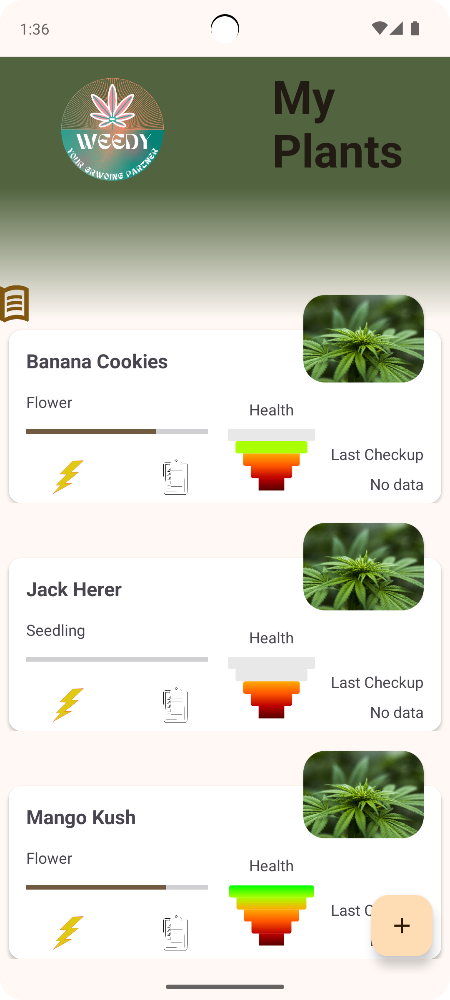
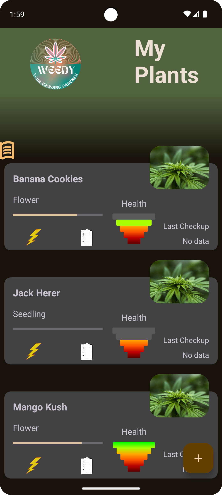
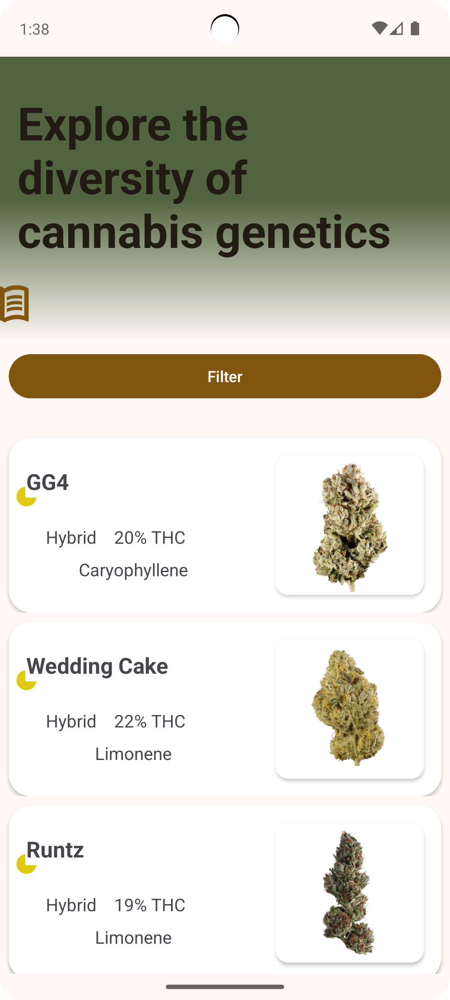
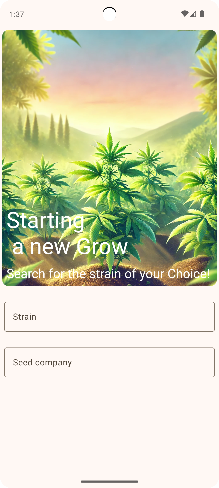
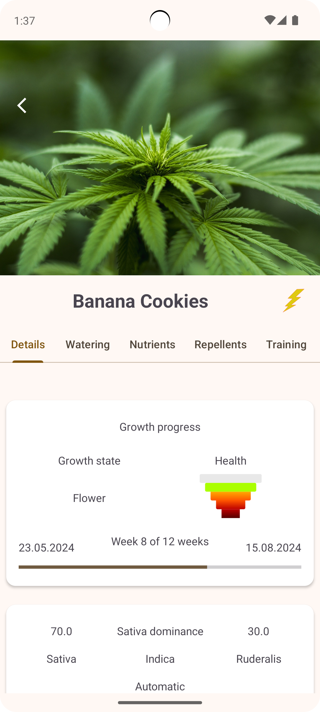
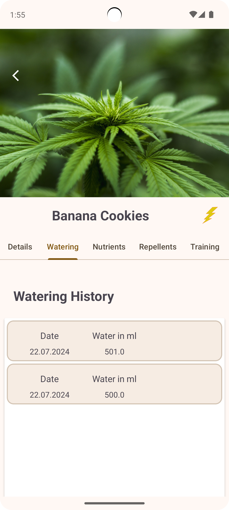

# Weedy - Dein digitaler Grow-Assistent


## Über Weedy

Weedy ist deine ultimative Begleiter-App für den privaten Cannabisanbau in Deutschland. Entwickelt
mit Kotlin für Android, bietet Weedy eine umfassende Plattform zur Unterstützung und Dokumentation
deines gesamten Anbau-Prozesses.

## Benutzerfreundlichkeit

Weedy wurde mit dem Fokus auf eine intuitive Benutzeroberfläche entwickelt. Egal, ob du dein erstes
Pflänzchen anbaust oder bereits ein erfahrener Grower bist, die App führt dich mit einer einfachen
Oberfläche durch den gesamten Prozess.

## Hauptfunktionen

- **Riesige Sortenauswahl**: Zugriff auf über 8.000 Cannabis-Sorten aus einer API
- **Inspirations-Datenbank**: Entdecke mehr als 4.000 Sorten mit detaillierten Filtermöglichkeiten
- **Individuelle Pflanzen-Profile**: Lege deine eigenen Pflanzen an und verfolge ihren Fortschritt
- **Umfassende Anbau-Dokumentation**:
    - Gieß- und Düngepläne
    - Trainingsmethoden
    - Schädlingsbekämpfung
    - Lichtzyklus-Management
    - Umtopf-Protokolle
    - Keimungs-Tracking
- **Ernte-Prognose**: Behalte den Überblick über deine voraussichtlichen Erntezeiten
- **Übersicht der Wachstumsphasen**: Verfolge jede Phase des Wachstums und erhalte wertvolle
  Einblicke, um deinen Anbau zu optimieren.

## Screenshots

**Homescreen**

**Homescreen**

**Homescreen**

**Homescreen**

## Vorteile

- **Optimierung des Anbaus**: Mit Weedy behältst du den Überblick über alle wichtigen Faktoren
  deines Anbaus und kannst deine Methoden entsprechend anpassen.

- **Inspiration durch Vielfalt**: Lass dich von der großen Auswahl an Sorten inspirieren und finde
  die besten Pflanzen für deine individuellen Bedürfnisse.

- **Dokumentation und Analyse**: Halte alle wichtigen Daten fest und analysiere deinen Anbau, um
  zukünftig noch bessere Ergebnisse zu erzielen.

## Datenschutz & Legalität

Weedy wurde unter Berücksichtigung der aktuellen deutschen Gesetzgebung zum privaten Cannabisanbau
entwickelt. Alle Daten werden lokal auf deinem Gerät gespeichert, um deine Privatsphäre zu schützen.

## Installation

1. Klone dieses Repository:
   ```bash
   git clone https://github.com/deinbenutzername/weedy.git
   ```

2. Öffne das Projekt in Android Studio.

3. Stelle sicher, dass alle Abhängigkeiten installiert sind.

4. Starte die App auf einem Emulator oder einem physischen Android-Gerät.

## Technologien

- **Sprache**: Kotlin
- **Plattform**: Android
- **Datenbank**: [Room]
- **API**: Integration einer Cannabis-Sorten-API für die Sortenliste

## Mitwirken

Wir freuen uns über Beiträge zur Verbesserung von Weedy! Wenn du Ideen oder Fehlerberichte hast,
öffne bitte ein Issue oder erstelle einen Pull Request.

## Lizenz

Dieses Projekt ist unter der Apache Lizenz 2.0 lizenziert. Siehe die [LICENSE](./LICENCE) Datei für
weitere Informationen.

## Kontakt

Falls du Fragen oder Anregungen hast, erreichst du mich unter:

- **E-Mail**: jonasgoetzenberger@icloud.com
- **GitHub**: [Jonnyshotu](https://github.com/Jonnyshotu)

---


Happy Growing mit Weedy! 🌱